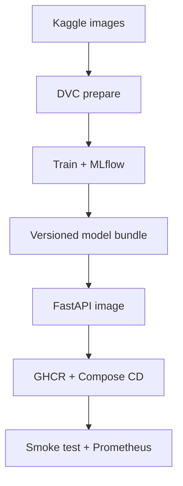

# Cats vs Dogs - End-to-End MLOps Assignment

This repository is a rubric-complete reference implementation for a pet-adoption cat/dog classifier. It covers Git/DVC versioning, reproducible training, MLflow, FastAPI, pytest, Docker, GHCR CI, Compose CD, smoke tests, logs, Prometheus metrics, and post-deployment performance tracking.

Prepared for GitHub user [Navneet-Kang](https://github.com/Navneet-Kang). Recommended repository name: `cats-dogs-mlops-assignment`.

> Academic-integrity note: the bundled model is trained on explicitly synthetic rehearsal data so the repository runs immediately. Before submission, retrain with the assigned Kaggle dataset and report only those real-data results.

## Architecture

`Kaggle data -> DVC prepare -> 224 RGB + augmentation -> SGD baseline -> MLflow/joblib -> FastAPI -> Docker/GHCR -> Compose -> metrics/evaluation`



## Quick rehearsal

Python 3.11 and Docker are recommended.

```bash
python -m venv .venv
source .venv/bin/activate
pip install -r requirements-dev.txt
make demo-data
make train
make test
make api
```

In a second terminal:

```bash
make smoke
make evaluate
curl http://localhost:8000/metrics
```

Prometheus is available at `http://localhost:9090` when Docker Compose is running.

MLflow UI:

```bash
mlflow ui --backend-store-uri ./mlruns --port 5000
```

## Get the real data

Download the Kaggle Cats and Dogs classification dataset linked in the assignment. Arrange either of these layouts:

```text
data/raw/cat/*.jpg          data/raw/train/cat.*.jpg
data/raw/dog/*.jpg          data/raw/train/dog.*.jpg
```

Then version and reproduce:

```bash
# First change data.source in params.yaml to kaggle-cats-dogs.
dvc init
dvc add data/raw
git add .dvc .gitignore data/raw.dvc dvc.yaml params.yaml
git commit -m "Version cats-dogs dataset and pipeline"
dvc repro
dvc metrics show
dvc plots show artifacts/history.csv
```

The default cap is 5,000 images per class for a fast CPU baseline. Change `max_samples_per_class` in `params.yaml` if your machine permits. Split ratios are stratified 80/10/10. Training augmentation uses random horizontal flips and brightness jitter.

## API and container

```bash
uvicorn app.main:app --host 0.0.0.0 --port 8000
curl http://localhost:8000/health
curl -F "file=@sample.jpg" http://localhost:8000/predict
docker compose up -d --build
python scripts/smoke_test.py --url http://localhost:8000 --image sample.jpg
```

Expected prediction schema:

```json
{"label":"cat","probabilities":{"cat":0.91,"dog":0.09}}
```

## CI/CD setup

The GitHub Actions workflow:

1. checks out and installs pinned dependencies;
2. runs tests and coverage;
3. builds the Docker image;
4. publishes main-branch images to GHCR as both commit SHA and `latest`;
5. deploys the immutable SHA image on a self-hosted runner labeled `cats-dogs-deploy`;
6. fails if health or prediction smoke tests fail.

Add a self-hosted runner on the Compose deployment machine, give it the custom label `cats-dogs-deploy`, install Docker, and grant it access to this repository. Use a GitHub `production` environment if approval protection is desired. No long-lived registry secret is needed because GHCR uses `GITHUB_TOKEN`.

Create and push the repository (after reviewing all files):

```bash
git init
git branch -M main
git add .
git commit -m "Complete end-to-end cats-dogs MLOps pipeline"
git remote add origin https://github.com/Navneet-Kang/cats-dogs-mlops-assignment.git
git push -u origin main
```

If you choose a different repository name, only the remote URL changes. The image remains `ghcr.io/navneet-kang/cats-dogs-api`.

## Monitoring and performance

- Structured logs include request ID, route, status, and latency, but exclude filenames and image bytes.
- `/metrics` exposes `prediction_requests_total` and `prediction_latency_seconds` for Prometheus.
- `scripts/post_deploy_evaluate.py` sends a labeled batch and writes accuracy, dog F1, and per-record outputs to `artifacts/post_deploy_metrics.json`.

## Mark-oriented hand-in

Read `REPORT.md`, follow `SUBMISSION_CHECKLIST.md`, and record `DEMO_SCRIPT.md`. These make every rubric item easy to locate and demonstrate. Your final submission ZIP should include fresh real-data `models/` and `artifacts/` outputs, but should not include raw Kaggle images, credentials, `.venv`, or `mlruns` internals unless your instructor explicitly requests them.
